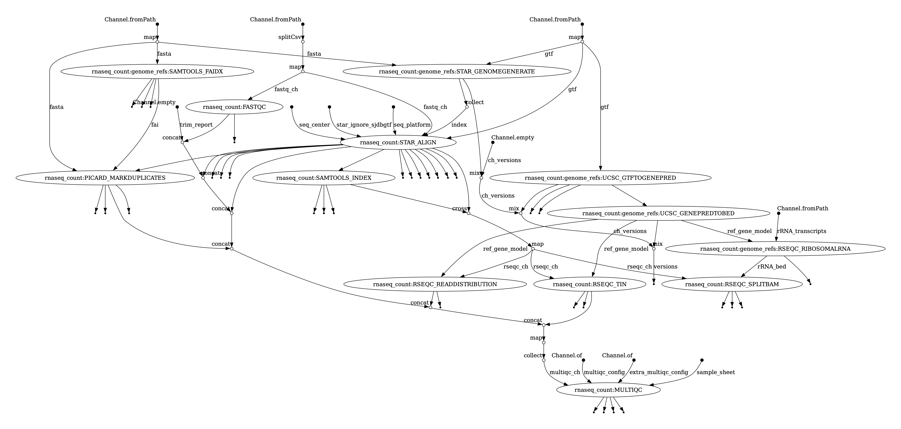

# RNA-seq Alignment, QC, and Quantification Nextflow Pipeline 

# About the Workflow

This workflow is designed to output gene expression counts from STAR aligner using [`--quantmode`](https://physiology.med.cornell.edu/faculty/skrabanek/lab/angsd/lecture_notes/STARmanual.pdf). It will also perform general QC statistics on the fastqs with [fastqc](https://www.bioinformatics.babraham.ac.uk/projects/fastqc/) and the alignment using [rseqc](https://rseqc.sourceforge.net/). Finally, the QC reports are collected into a single file using [multiQC](https://multiqc.info/).

A DAG (directed acyclic graph) of the workflow is show below:



# Set-up the Environment 

```
python3 -m venv venv 
source venv/bin/activate 
python3 -m pip install -r requirements.txt
```

```
nextflow -version
nf-core --version
```

# Run the pipeline 

Open the step-by-step instructions to run the workflow in **[`workflow_docs/workflow_run.md`](workflow_docs/workflow_run.md)**. 

## Authors

- [Jenny L. Smith](https://github.com/jennylsmith)

## Acknowledgements

This pipeline was generated using `nf-core tools` CLI suite and publically available modules from [`nf-core`](https://nf-co.re/about). 

> The nf-core project came about at the start of 2018. Phil Ewels (@ewels) was the head of the development facility at NGI Stockholm (National Genomics Infrastructure), part of SciLifeLab in Sweden.

> The NGI had been developing analysis pipelines for use with it’s genomics data for several years and started using a set of standards for each pipeline created. This helped other people run the pipelines on their own systems; typically Swedish research groups at first, but later on other groups and core genomics facilities too such as QBIC in Tübingen.

> As the number of users and contributors grew, the pipelines began to outgrow the SciLifeLab and NGI branding. To try to open up the effort into a truly collaborative project, nf-core was created and all relevant pipelines moved to this new GitHub Organisation.

> The early days of nf-core were greatly shaped by Alex Peltzer (@apeltzer), Sven Fillinger (@sven1103) and Andreas Wilm (@andreas-wilm). Without them, the project would not exist.